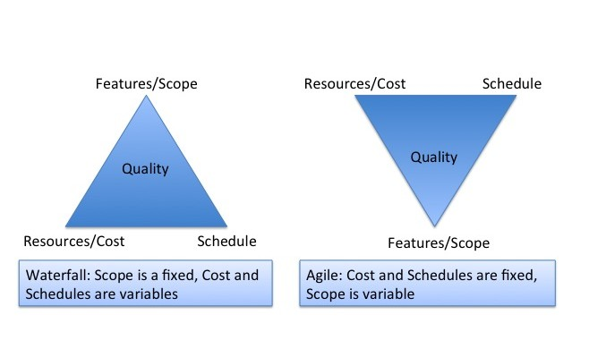
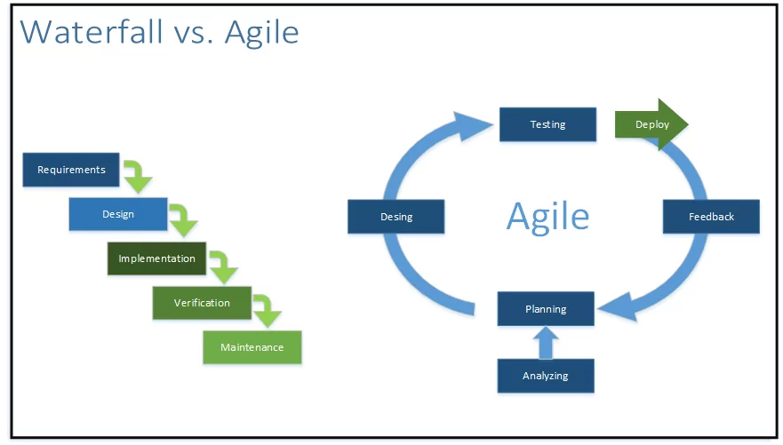
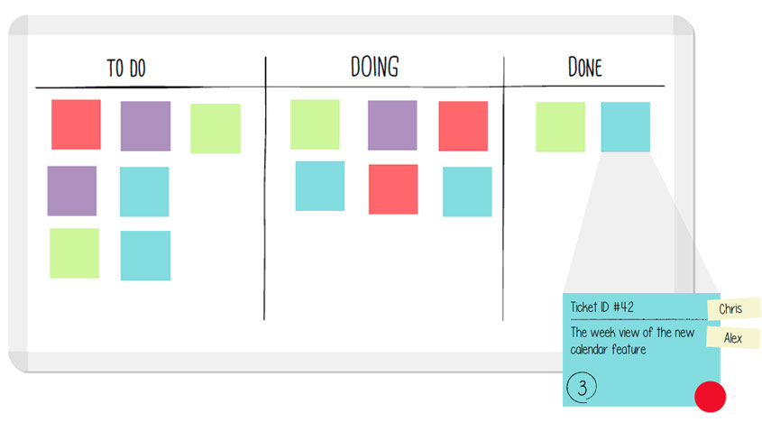
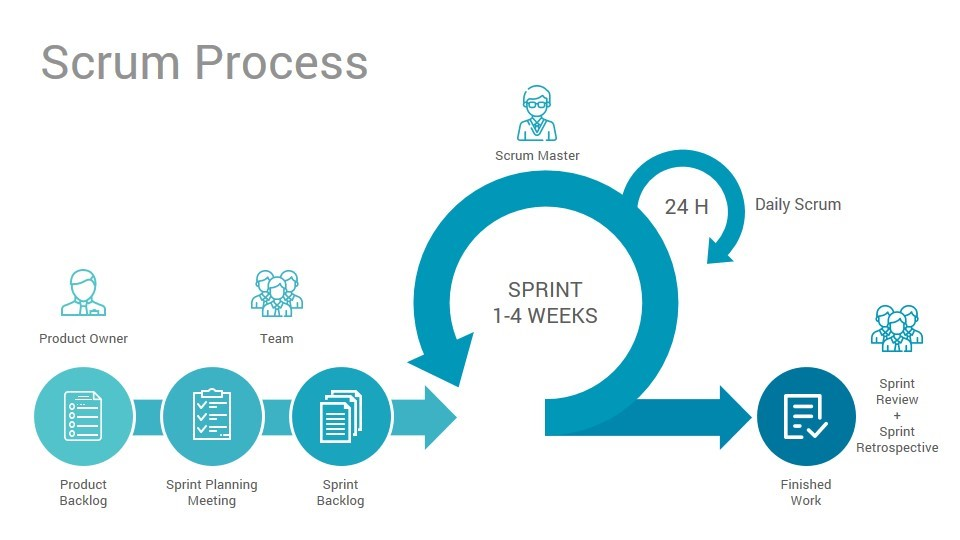
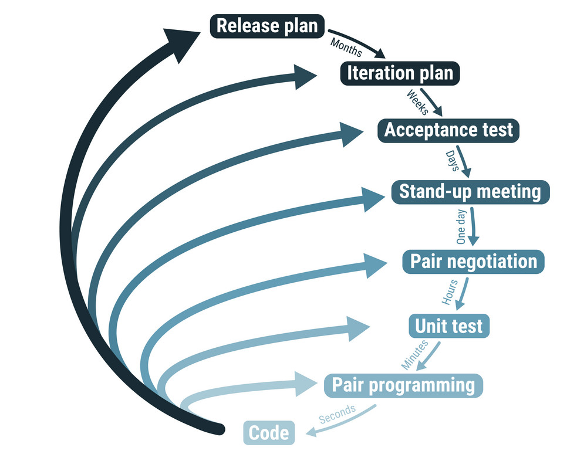
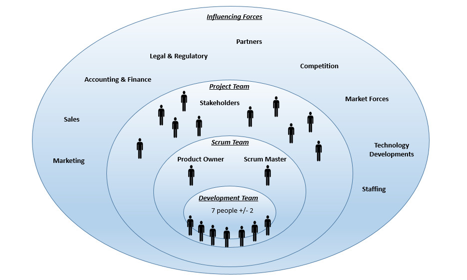
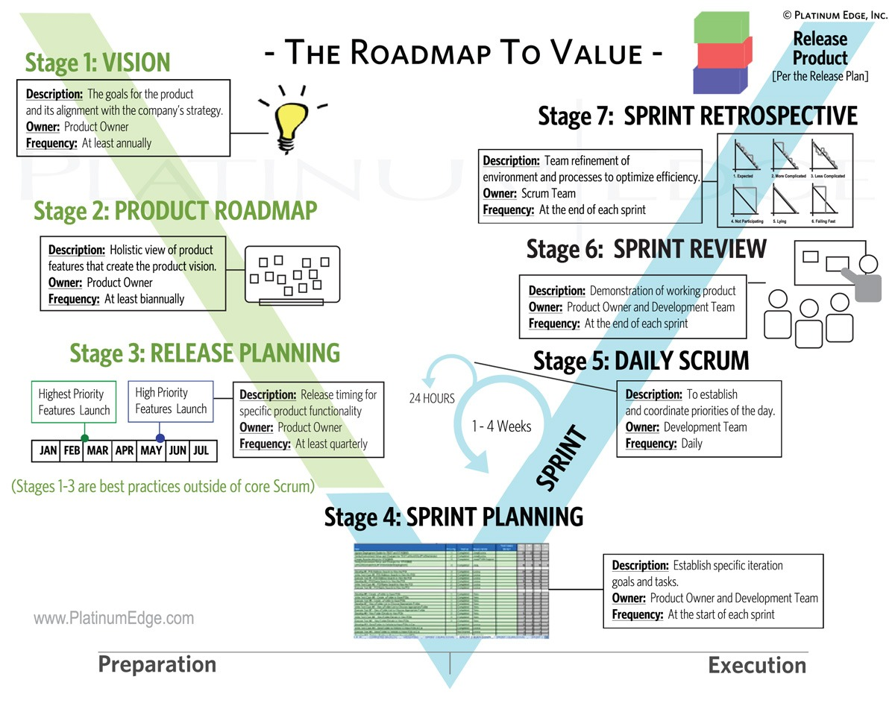
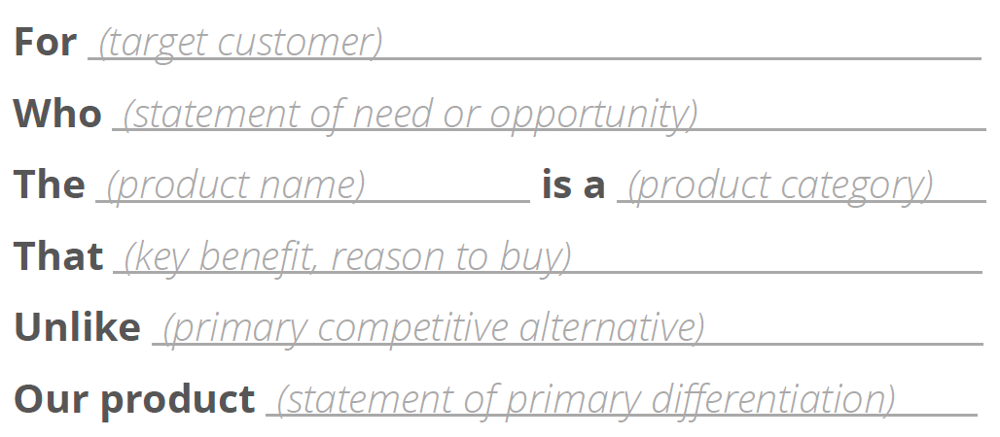
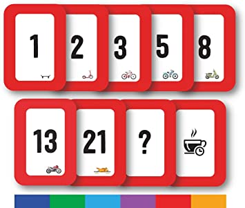

# Agile Project Management

Project management has only been around since half the twentieth century. 
Winston Royce wrote "Managing the development of Large Software Systems" in the 1970s,
which described the phases in the 'waterfall methodology' as it was coined later.

This methodology was the most common project management approach until it was surpassed
by improved approaches based on agile techniques around 2008.

Traditional projects (if successful at all) often suffer from scope bloat.
Studies show that 64% of requested features are rarely or never used.

Agile techniques are simply a codification of common sense of which seeds date back to
Walter Sherwart's Plan-Do-Study-Act (PDSA).
In 1986, Hirotaka Takeuchi and Ikujiro Nonaka published an article "New Product Development Game"
describing aa rapid, flexible development strategy to meet fast-paced product demand.
This article first paired the word 'Scrum' with product development, which became one of the most
popular agile project management frameworks.

In 2001 the **'Agile Manifesto'** was created, a statement of values for successful software development.

- **Individuals and interactions** over processes and tools
- **Working software** over comprehensive documentation
- **Customer collaboration** over contract negotiation
- **Responding to change** over following a plan

*While there is value in the items on the right, we value the items on the left more.*

Empirical control requirements:
- Unfettered transparency
- Frequent inspections
- Immediate adaptations

*Working in **sprints** (smaller segments of the overall project) allows for this frequent inspection and adaptation.*

**Strengths of Agile Project Management**:
- Project success rate
- Scope creep
- Immediate adaptation based on frequent inspection
    - Progress
    - Customer satisfaction

### Individuals and interactions over processes and tools

The unique contributions of many individuals can be very powerful.
Where a simple conversation can be clear and efficient, a lot of effort is needed to make
processes and managed/controlled communication unambiguous.
One process doesn't fit all teams and limits involvement of individuals.
Working without individual interactions is overall less Agile.

### Working software over comprehensive documentation

Supporting development:
- Requirements
- Product technical specifications

*This documentation should cover only 'just enough' information to be practical and efficient.*

Supporting management:
- Project schedule
- Weekly status reports
- Project communication plan

*While helping management, these do not add value to development.*

### Customer collaboration over contract negotiation

There should be an ongoing good and clear communication with the customer.

Traditionally:
- Start of project
- When scope changes
- End of project

Communication purely for negotiation discourages potentially valuable input from the customer.

You can't know less about a project than at the start,
so locking down project details at this point is hard due to a lack of information.

### Responding to change over following a plan

Frequently adapting to changing expectations will keep the project relevant and also avoids high costs
from making changes in a later stage of product maturity.

## Agile Principles

The 12 Agile principles:
- Our highest priority is to satisfy the customer through early and continuous delivery of valuable software.
- Welcome changing requirements, even late in development. Agile processes harness change for the customer's competitive advantages.
- Deliver working software frequently, from a couple of weeks to a couple of months, with a preference to the shorter timescale.
- Business people and developers must work together daily throughout the project.
- Build projects around motivated individuals. Give them an environment and support they need, and trust them to get the job done.
- The most efficient and effective method of conveying information to and within a development team is face-to-face conversation.
- Working software is the primary measure of success.
- Agile processes promote sustainable development. The sponsors, developers and users should be able to maintain a constant pace indefinitely.
- Continuous attention to technical excellence and good design enhances Agility.
- Simplicity - the art of maximizing the work not done - is essential.
- The best architectures, requirements and designs emerge from self-organizing teams.
- At regular intervals, the team reflects on how to become more effective, then tunes and adjusts its behaviour accordingly.

Additional 3 'platinum' principles:
- Resist formality
  - Reduce organizational hierarchy, by eliminating titles
  - Avoiding aesthetic investments like elaborate PowerPoint presentation and meeting minute forms
  - Educating stakeholders on the cost of such displays
- Think and act as a team
  - Develop in pairs and switch partners often
  - Uniform product development title
  - Report at the project team level only
  - Replace individual performance metrics with project team performance metrics
- Visualize rather than write
  - Stock on whiteboards, poster paper and drawing utilities
  - Using models instead of text to communicate concepts
  - Reporting project status through charts, graphs and dashboards
  

## Agile vs Historical Approaches

*In Agile development cost and schedules are fixed. It is the scope that is variable.*

### Agile Project Team
- Developers
- Testers
- Designers
- Project stakeholders
- Product owner
- Agile coach
- Scrum master

The **product owner** is a project team member who is an expert on the product and the customer's business needs.
They prioritize product requirements and is available to provide daily clarifications and final acceptance to the development team.

The **Scrum master** acts as a buffer between the development team and distractions that slow down development effort.
They ensure that scrum is played properly and continuously improves the team's environment.

The **Agile coach** provides expertise on agile processes and facilitate consensus building and stakeholder communication.
Often this person is external to the projects department, offering an outsiders point of view.

### Sprints

Working in small **sprints** and completing functionality by priority ensures the project will add value for the customer.
While some features might not yet be implemented, the product will always have useful functionality even halfway the production process.
Historical approaches often require the project to be finished before adding any value to the customer and at this point 
making any changes would be harder and more expensive.

*Working in sprints provides areas of project stability, while also allowing for regular change.*

### Reducing Non-Productive Tasks

- In traditional projects **meetings** often take up a lot of time from developers, allowing for little time for development.
  Agile projects should require only little formal meetings. They are focussed, short and handle a specific topic.
  The Agile coach should try to prevent disruptions, which include non-agile meetings.
  The project status is usually visually available to the entire organization, removing the need for status meetings.

- Asking questions through **mail** is slow and inefficient. Face-to-face communication is faster and more concise.

- Preparing a *presentation* (with slides etc.) takes up a lot of time. A simple demonstration of the product fulfilling
  required functionality is both faster and more representable.

- Documentation is only useful when it adds value to the project. Our code and automated tests already document a lot of the
  development decisions that were made. Pictures & charts are usually more understandable than words, even for reporting to management.

### Improved Team Performance

- Environmental and organizational support for the team
  - Collocation of team with product owner, physically close to customer
  - Eliminating confusion
  - Removal of impediments
- Focus on the project
  - One project that gets all the focus
  - Availability of team members
  - Small independent units of functionality
  - No distractions = more productivity
- Continuous improvement
  - Each iteration is a fresh start
  - Quick incorporation of changes
  - A retrospective allows identifying and planning improvements
  - Entire team reviews aspects that need improvement
  - Lessons learned are taken to next sprint
- Tighter project control
  - Constant flow of information
  - Daily prioritization
  - Working functionality each sprint
  - No administrative cost to changes in 'next' sprint
  - Feature adequacy check at each sprint makes termination easy

*Agile development is not only faster, but allows for early detection of failure.
Providing opportunity to fix problems early and reduce the costs to do so.*

### Return On Investment (ROI)

- Functionality is delivered to the marketplace earlier
- Product quality is higher
- Revenue opportunity can be accelerated
- Projects can self-fund

### Strategies Reducing Wasted Time

- Just-in-time elaboration
- Customer and stakeholder participation
- A bias for face-to-face conversation
- Built-in exploitation of change
- Emphasis on the evidence of working functionality

### Development Team Benefits

- A clear definition of success
- The power and respect to self-organize
- Customer feedback they need to provide value
- Protection from disruptions
- A humane, sustainable pace of work
- A culture of learning that support both personal development and project improvement
- A structure that minimizes non-development time

## Agile Practices

Different approaches:
- Lean (Kanban)
- Scrum
- Extreme programming
- ...

### Lean

*Methodology with roots in manufacturing processes as implemented by Toyota.*

Principles:
- Eliminate waste
- Amplify learning
- Deliver as late as possible (allowing for late adaptation)
- Deliver as fast as possible
- Empower the team
- Build quality in (correcting defects when they happen)
- See the whole (solving problems, not symptoms)

### Kanban

*Kanban (Japanese for 'visual signal') is a method for removing waste to improve flow and throughput in a system.*

Practices:
- Visualize (to help identify waste)
- Limit work in progress
- Manage flow
- Make process policies explicit
- Implement feedback loops
- Improve collaboratively, evolve experimentally

### Scrum

*Scrum is an iterative approach with the 'sprint' at its core.*

- Daily scrum meeting reviewing yesterday's work and planning for today's
- Constant inspections to assess the progress towards the sprint goal
- A retrospective at the end of a sprint to assess performance

Artifacts:
- Product backlog
- Sprint backlog
- Product increment

Events:
- Sprint planning
- Daily scrum
- Sprint
- Sprint review
- Sprint retrospective

### Extreme Programming

Principles:
- Coding is the core activity
- Lots of testing
- Direct communication between programmer and customer
- Complex systems require some level of overall design, beyond any specific function

Practices:
- **Planning Game**  
  No disconnect between business and technical people
- **Whole Team**  
  Customer is collocated with the development team
- **Coding Standards**  
  Standard code identifiers and naming conventions
- **System Metaphor**  
  Use of an implied comparison, a simple story
- **Collective Code Ownership**  
  Anyone can modify/improve any code
- **Sustainable Pace**  
  Avoid mistakes by avoiding working more than 40h / week
- **Pair Programming**  
  Strategic driver and tactical navigator pairs
- **Design Improvement**  
  Continuously refactor
- **Simple Design**  
  Keep the cost of changes low
- **TDD**  
  Red-Green-Clean
- **Continuous Integration**  
  Integrate code timely and avoid compounding problems
- **Small Releases**  
  Release value to customer often, avoiding extensive regression and integration efforts

### Additional Powerful Tools

- **Product Vision Statement**  
  Gives direction for outer boundary of the project
- **Product Roadmap**  
  Required features for project vision
- **Velocity**  
  Tool to predict delivery of functionality
- **Release Planning**  
  Mid-range functionality goals/releases
- **User Stories**
  Requirements through end-user's point of view, clarifying business value
- **Relative Estimation**  
  Using relative complexity and effort rather than absolute measures
- **Swarming**  
  Cross-functional teams working together on a requirement

## The Environment

Why collocating the team is important:
- Face-to-face communication
- Scrum meetings standing up, to keep them brief and on topic
- Using low-tech tools for communication
- Getting real-time clarifications from scrum team members
- Being aware of what others are working on
- Asking for help with tasks
- Supporting others with their tasks

### Dedicated Project / Scrum Room

- Central collaboration area or table
- Whiteboards and bulletin boards
- Open workspaces (around the edges)
- Remove distractions
- Mobile furniture (desks, laptops, whiteboards, ...)

*Avoid cubical arrangements, or be creative to create a scrum room out of a couple of them.*

### Common Distractions

- Multiple projects
- Multitasking
- Over-supervising
- Outside influence
- Management

### In Absence of Collocation

- Videoconferences
- Instant messaging
- Web-based desktop sharing
- Collaborating websites

### Tools

*Tools should solve a specific problem and push forward with the work.
They should be as simple and straight forward as possible and not feel like an additional layer of complexity.
Needs for these tools will emerge naturally from the scrum team.*

## Behaviour

*The product owner, development team and scrum master together make up the scrum team.
Each role is a peer to the others - no one is the boss of anyone on the team.*

### Product Owner

*The product owner takes on a great responsibility during the project. Although the product sponsor
funds and owns the budget, the product owner manages how the budget is spent.*

What makes a good product owner:
- Develops strategy and direction and sets long- / short- term goals
  - Envisions completed product
  - Understands company strategy
- Provides or has access to product expertise
  - Worked with similar products in the past
  - Understands the needs of end-users
- Understands and conveys stakeholder needs
  - Understands relevant business processes
  - Creates a solid customer input feedback channel
  - Works well with business stakeholders
- Gathers, prioritizes and manages product requirements
  - Is decisive
  - Focuses on efficiency
  - Remains flexible
  - Turns stakeholder feedback into valuable customer-focused functionality
  - Is practical about prioritizing financially valuable features, high-risk features and strategic system improvements
  - Shields the development team from distractions
- Takes responsibility for the product's budget and profitability
  - Understands what features deliver the best ROI
  - Manages budgets effectively
- Decides when to release completed functionality
  - Understands business needs regarding timelines
- Works with the development team, answering daily questions and makes decisions
  - Is accessible
  - Works well with developers
  - Adeptly describes product features
  - Understands requirements and ensures completed features work correctly
- Presents the scrum team's accomplishments before the development team demonstrates them
  - Is good at framing the value and accomplishments from the scrum team

### Development Team Member

What makes a good developer:
- Directly accountable for creating project deliverables
  - Enjoys creating products
  - Is skilled in more than one of the jobs necessary to create the product
- Self-organizing and self-managing
  - Exudes initiative and independence
  - Understands how to work through impediments to achieve goals
  - Coordinates the work to be done with the rest of the team
- Cross-functional (elaborate, design, develop, test, integrate and document working functionality)
  - Has curiosity
  - Willingly contributes to areas outside his or her mastery
  - Enjoys learning new skills
  - Enthusiastically shares knowledge
- Multi-skilled (contribute, learn and teach)
- Dedicated to one project
- Collocated

### Scrum Master

*Don't underestimate the value of a scrum master with clout. Clout is not the same thing as authority.
It is earned through: expertise, longevity, charisma and associations.*

What makes a good scrum master:
- Acts as a process coach, helps to organise and follow scrum values
  - Is an expert on scrum processes
  - Is passionate about agile techniques
- Helps remove project impediments
  - Has organizational clout and can resolve problems quickly
  - Is articulate, diplomatic and professional
  - Is a good listener
  - Is firm about the development team's need to focus only on the current sprint
- Fosters close cooperation between stakeholders and scrum team
  - Looks at the needs of the project as a whole
  - Avoids cliques and helps break down group silo's
- Facilitates consensus building within the scrum team
  - Understands techniques to help groups reach agreements
- Protects the scrum team from organizational distractions
  - Doesn't feel the need to be in charge
  - Ensures everyone has the information they need
  - Truly desires to help the scrum team

### Stakeholders

Can include:
- Customer
- Infrastructure architects / system administrators
- Legal department / account managers / salespeople / marketing experts / customer service representatives
- Other product or subject-matter experts

### Agile Mentor

- Serves in a mentoring role only and isn't part of the scrum team
- Is often a person from outside the organization
  - Can provide objective guidance
  - Has no personal or political considerations
- Is an agile expert with significant experience in implementing agile techniques

### Values

Five core values for scrum teams:
- Commitment
- Courage
- Focus
- Openness
- Respect

### Team Philosophy

Requirements and results of the right philosophy:
- Dedicated team
  - More accurate release projections
  - Effective, short iterations
  - Fewer and less costly defects
- Cross-functionality
  - Setting aside the narrow label of what he/she can do
  - Working to expand skills
  - Stepping up to help someone who has run into a roadblock
  - Being flexible
- Self-organization
  - Commitment to sprint goals
  - Identifying of tasks
  - Estimating the effort necessary for requirements and related tasks
  - Focus on communication
  - Collaboration
  - Decisions with consensus
  - Active participation
- Self-management
  - Allows leadership to ebb and flow
  - Relying on agile processes and tools managing the work
  - Regular and transparent reporting
  - Issues managed within the development team
  - Creation of team agreements
  - Inspection and adaptation
- Size-limited teams
  - Encourages diverse skills to be developed
  - Facilitates good team communication
  - Maintains the team in a single unit
  - Promotes joined code ownership
  - Promotes face-to-face communication
- Ownership
  - Taking initiative
  - Succeeding and failing as a team
  - Trusting the ability to make good decisions

## Defining Product Vision and Roadmap

*Agile projects involve planning upfront and throughout the entire project.*

### Progressive Elaboration

Planning only as much as you need to: 
- Widely and holistically at first
- More detailed only just-in-time
  - Inspect
  - Adapt

### The Product Vision Statement

Four steps:
- Develop the product objective
- Create a draft vision statement
- Validate the vision statement with product and project stakeholders and revise it based on feedback
- Finalize the vision statement

### The Product Roadmap

Five steps:
- Identify stakeholders
- Establish product requirements and add them to the roadmap
- Arrange the product requirements based on values
- Estimate the development effort at a high-level and prioritize the product requirements
- Determine high-level time frames for releasing groups of functionality to the customer

### The Product Backlog

Including:
- A description of each requirement
- The order of requirements based on priority
- The effort estimates
- The type of backlog item
- A status

## Planning Releases and Sprints

*A clear and effective format for defining product requirements is the user story.*

### User Story

Includes:
- Title
- "As a..." (type of user)
- "I want to..." (desired action)
- "So that..." (reason or achieved benefit)
- "When I..." (action taken) (desired behaviour)

Also:
- ID
- Value and effort estimate
- Creator

Knowing the end users and the stakeholders intentions are key to creating these user stories.
To better connect with the end-user we create personas representing different potential customers.

**Decomposing User Stories**:
- Theme
  - Features
    - Epic user stories
      - User stories

**The INVEST approach to user stories**:
- Independent
- Negotiable
- Valuable
- Estimable
- Small
- Testable

### Estimation Poker

