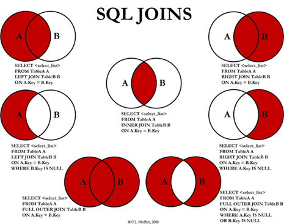

# Relational Databases

### Unstructured Data:
- More than 80% of all data

### Structured Data:
- SQL data

Advantages:
- Data consistency
- More information from the same data
- Improved data integrity
- Improved security
- Improved maintenance

## Elements of a Database

- Schema’s
- Catalogues & extensions
- Relation / Table
    - Attributes / Columns (# = Degree) – Domain (For example €: 0 -> ∞)
    - Tuples / Rows (# = Cardinality)
- Primary / Foreign Keys

## Relational Keys

- **Superkey**: any combination of columns that uniquely identify a row in a table
- **Candidate key**: A superkey such that no proper subset is a superkey, with the following two properties:
    - Uniqueness
    - Irreducibility
- **Primary key**: The candidate key that is selected to identify tuples uniquely within the relation
- **Foreign key**: An attribute, or set of attributes, within one relation that matches the candidate key of some other relation

## Relational Database

A set of tables that satisfy following data integrity:
- **Entity Integrity**: No duplicate rows
- **Domain Integrity**: Enforcing valid entries for a given column
- **Referential Integrity**: Rows can not be deleted when referenced by other records
- **User-Defined Integrity**: Enforces some specific business rules

## Functional Dependency

Dependency occurs when an attribute or set of attributes identifies a particular value of another attribute.
When designing an efficient database that avoids redundancy, identifying dependencies help us to:
- Ensure every column in a table is dependent on the primary key
- Have the primary key as simple as possible

## Types of Joins

- **Inner Join**: Only rows with a match in both tables
- **Outer Join**
    - **Left Join**: All rows from the left table, even if there are no matches in the right
        - Where: A-Key = B-Key
        - Where: B-Key = NULL
    - **Right Join**: All rows from the right table, even if there are no matches in the left
        - Where: A-Key = B-Key
        - Where: A-Key = NULL
    - **Full Join**: Combines the results of both left and right outer joins
        - Where: A-Key = B-Key
        - Where: A-Key = NULL OR B-Key = NULL

- **Self Join**: Used to join a table to itself as if it were two tables, temporarily renaming at least one table in the SQL statement
- **Cartesian Join (Cross Join)**: Cartesian product of the sets of records from the two or more joined tables

## Database Design

Importance of knowing about good design:
- Understand why a database you are working with was designed a certain way
- Learn quicker how to navigate your way around
- See the potential vulnerabilities and flaws
- Communicate effectively

**Prime Attributes** are attributes that belong to at least 1 candidate key.
**Non-Prime Attributes** do not belong to any candidate key.

**Normalization** is the process of organizing the columns and tables of a relational database to reduce data redundancy and improve data integrity.

- **First normal form (1NF)**:
    - Doesn’t contain duplicate rows
    - Every cell contains only one value
- **Second normal form (2NF)**:
    - 1NF
    - Every non-prime attribute of the table is dependent on the whole of every candidate key
- **Third normal form (3NF)**:
    - 2NF
    - Every non-prime attribute is non-transitively dependent on every candidate key

The higher the normal form the better:
- Less prone to errors
- Faster adding of records in database

*We can improve normalization by splitting the table in multiple tables.*