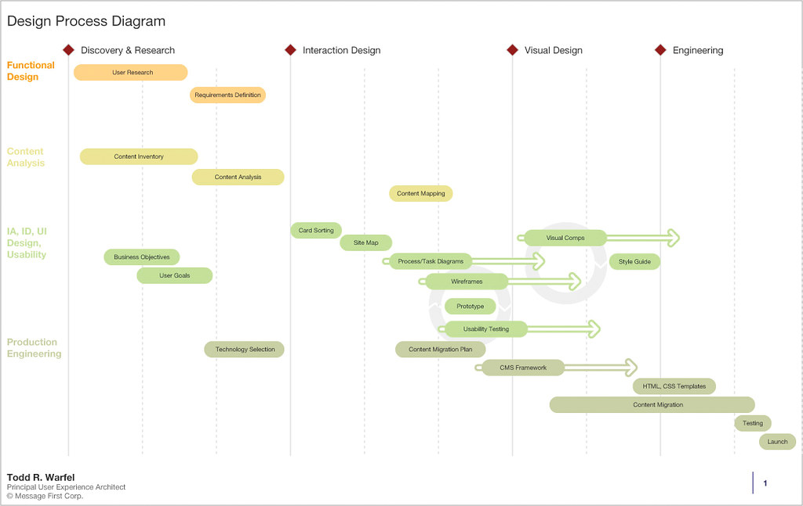
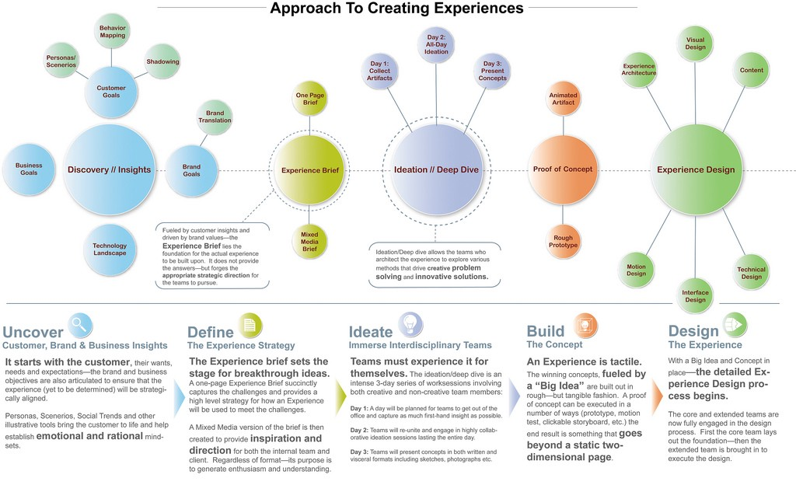
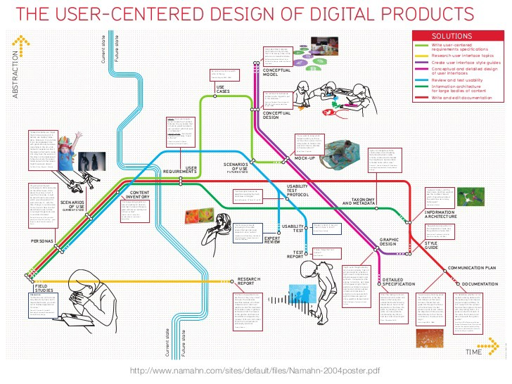
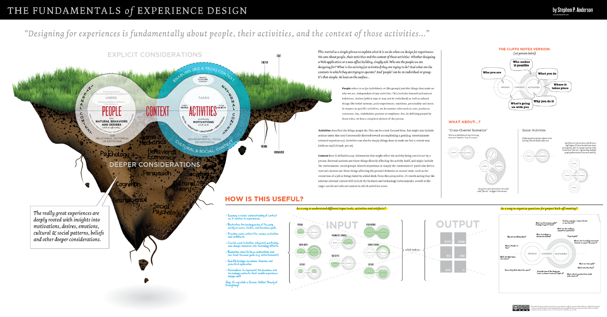
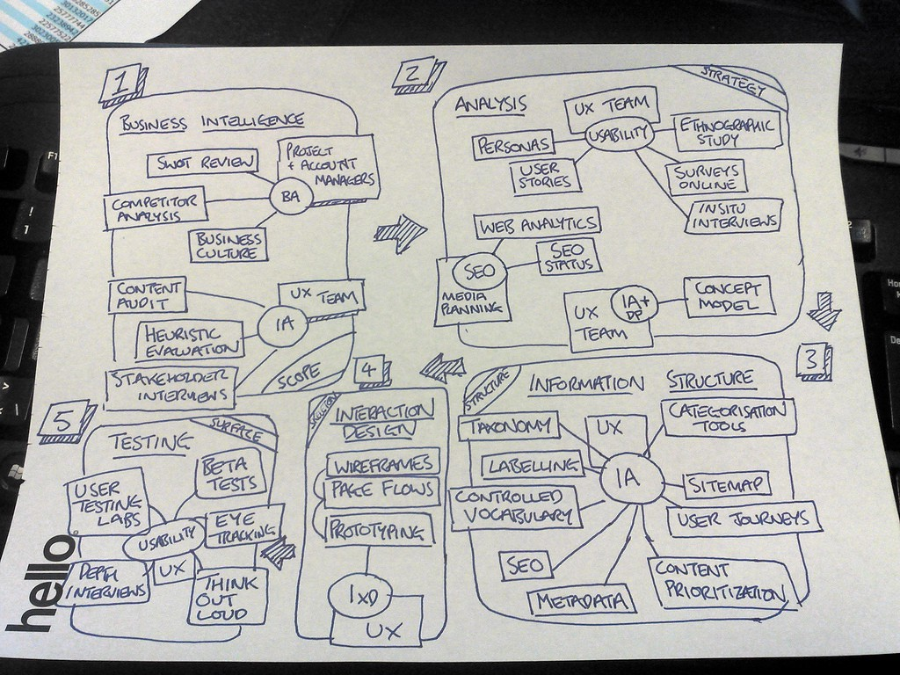

# The User Experience Team of One
Links:  
[Rosenfeld](https://rosenfeldmedia.com/books/the-user-experience-team-of-one/)  
[Flickr](https://www.flickr.com/photos/rosenfeldmedia/albums/72157634469079892)

Book principles:
- UX is a force for good
- The world needs more of it
- You can make that happen

## Philosophy

Requirements for a Team of One:
- Technical know-how
- Vision
- Conviction
- Soft touch

### UX 101

UX Definition:
- Messy to describe
- The overall effect created by the interactions and perceptions that someone has when using a product or service.
- Described with 'love' or 'hate', 'easy to use' or 'a pain in the ass'

Titles:
- User research specialist
- User experience designer
- Non-standard mix of titles

Disciplines:
- Interaction designer or information architect
- Visual Designer
- User Research
- Content Strategy or Copywriting

Sub-disciplines:
- Visual design
- Content strategy
- Copywriting
- Business analysis
- Product management
- Project management
- Analytics
- Search engine marketing and optimization
- Brand marketing
- Brand engineering

History:
- 1900: Frederick Winslow Taylor & Henry Ford research interactions between workers and their tools
- 1940: Lieutenant Colonel Paul Fitts research configurations of cockpit control knobs
- 1940: Toyota involves workers in troubleshooting and optimizing processes
- 1955: Henry Dreyfuss writes 'Designing for People'
- 1960: Academics do research in what we now call cognitive science
- 1970: PARC (Xerox Research Center) produce user interface conventions, the mouse and computer generated bitmap graphics
- 1990: Donald Norman coins the term 'user experience' at Apple

UX vs UI:
- UI is the visual interface
- UX encompasses the whole experience
  - UI
  - Hardware
  - User's context of use
  - USer's goals and & motivations
  - ...

Good backgrounds:
- Web or software development
- Editing, journalism or copywriting
- Graphic or print design
- Research, sociology anthropology and psychology
- Engineering
- Product management and business analysis

### Getting Started

Steps:
- Get to know the UX toolkit
- Establish a point of view of what can be improved
- Get to know your users
- Start designing

Todd Zaki Warfel's Model:

David Armano's Model:

Namahn's Model:

Stephen P. Anderson's Model:

James Kelway's Model:

Activities in UX process:
- Discovery
  - Stakeholder interviews
  - SWOT analysis
  - Requirements gathering
- Strategy
  - Design principles
  - Vision artifacts
  - Roadmaps
- User research
  - Primary user research
  - Secondary user research
  - Personas, mental models, and user stories
- Design
  - Information architecture / Site Map
  - Process and Task Diagrams
  - Wireframes
  - Design Comps
  - Detailed Specifications
  - Style and Pattern Guides
  - Prototypes
- Implementation
  - Usability testing
  - Implementation oversight
  - Metrics / analytics tracking

#### 1. Establish a view on the work to be done:
- Find parts of the product that everyone agrees need improvement
- Write a UX Project Plan, working your way back from questions that need to be answered

Method cards:  
These help identify activities that can provide user-oriented perspective

- [IDEO Method Cards](https://www.ideo.com/post/method-cards)
- [SAP Method Card](https://www.sap.com/dam/application-assets/sap-logo/sap-logo-method-card.pdf)
- [18F Method Card](https://methods.18f.gov/assets/downloads/18F-Method-Cards-Print-at-Home.pdf)

Objections:  
*We can avoid objections by not asking for permission, but rather provide 2 options.*

#### 2. Get to know your users:
- Figure out what you know (and don't know)
- Do guerrilla Research

[Article on optimal amount of user exposure](https://articles.uie.com/user_exposure_hours/):
- Two hours
- A minimum of every 6 weeks
- In person and remote
- Including non-design personnel (aka everyone)

#### 3. Start designing:
- Sketch your ideas on paper or whiteboard
- Enlist colleagues to generate design ideas
- Learn from other successful products

An inspiration library:  
*A folder where you keep screenshots of notable designs, either for being good, or bad.*

### Building Support for Your Work

### Growing Yourself and Your Career

## Practice

### Planning and Discovery Methods

### Research Methods

### Design Methods

### Testing and Validation Methods

### Evangelism Methods

### What's Next