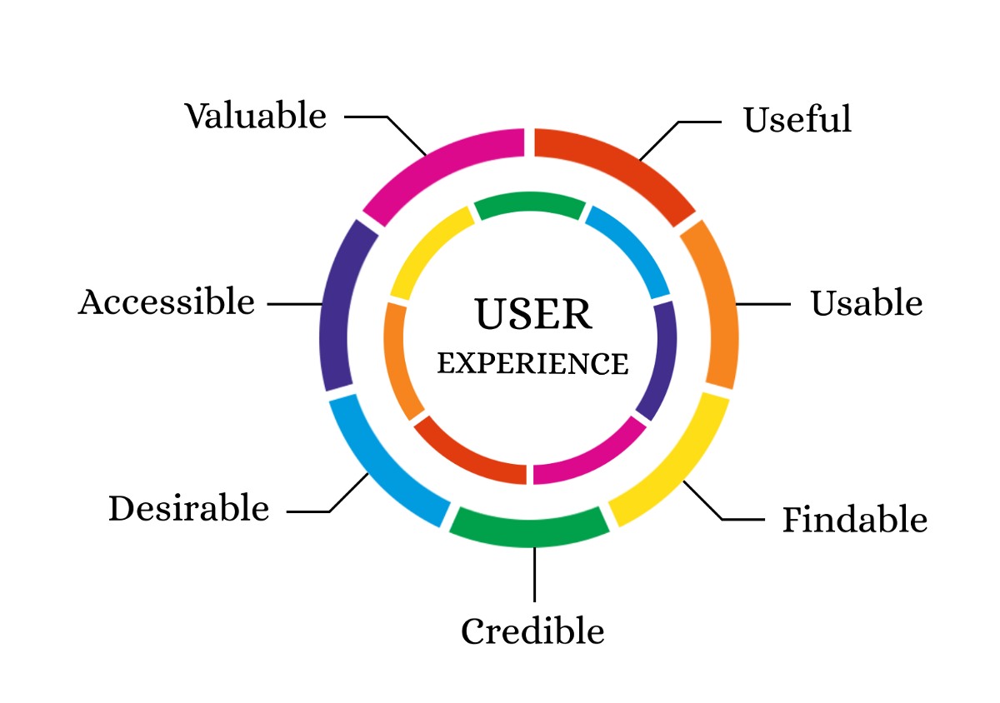
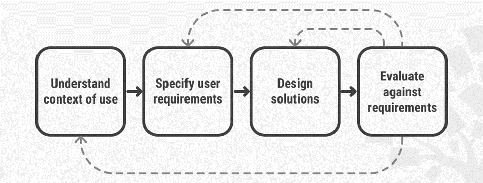
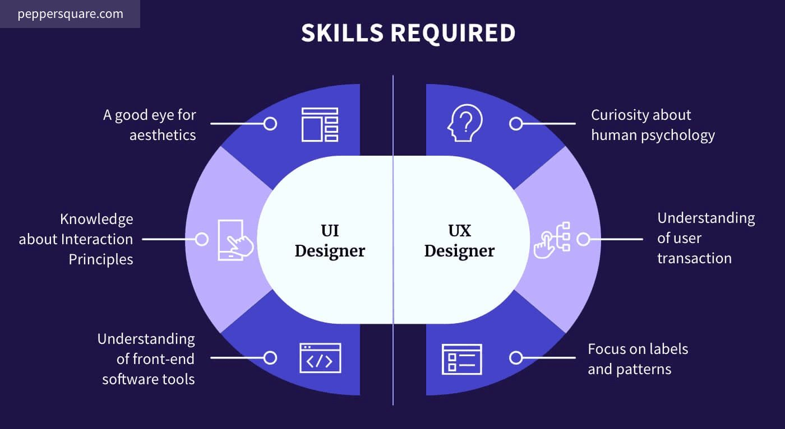
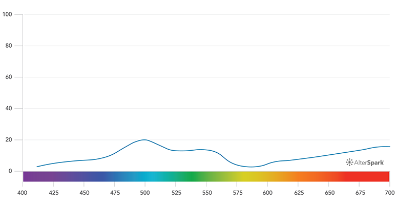

# UX

User experience (UX) design is the process design teams use to create products that provide meaningful and
relevant experiences to users. This involves the design of the entire process of acquiring and integrating
the product, including aspects of branding, design, usability and function.

- Deal with content and its stratification
- Deal with the prototyping and wireframing of the product
- Testing of the many different iterations
- Planning the development phases
- Execution of the design and analytics processing

## Books
- Emotional Design, by Don(ald) Norman
- Lean UX, by Jeff Gothelf and Josh Seiden
- UX for Lean Startups, by Laura Klein
- Agile Experience Design, by Lindsay Radcliffe and Marc McNeill
- Don't Make Me Think, by Steve Krug
- About Face, by Alan Cooper
- Designing for the Digital Age, by Kim Goodman
- Series: A Book Apart
- Author: Don Norman
- Author: Luke Wroblewski
- Author: Dan Pink

## User-Centered Design

## UX vs UI

### UX Keywords

- UX Psychology
- UX Methods
- UX Strategy
- Design Process
- Design Research
- Inclusive Design
- Mental Models
- Empathy Mapping
- Dark Patterns
- Universal Design
- Accessibility
- User Research
- User Interviews
- User Journey
- User Personas
- Affinity Diagram
- UX Microcopy
- Gamification
- UX Deliverables

## UI Keywords

- Visual Design
- Design System
- Grids
- Information Architecture
- Icons
- Typography
- Empty States
- Motion Design
- Prototyping
- App Design
- Interaction Design
- Heuristic Evaluation

## Psychological Design Principles

- **Aesthetic-Usability Effect:**

  Aesthetically pleasing design is perceived more usable.

- **Doherty Threshold:**

  Productivity soars when a computer and its users interact at a pace that neither has to wait on the other (<400ms latency).

- **Fitts' Law:**

  The time to acquire a target is a function of the distance to and size of the target.

- **Hick's Law:**

  The time it takes to make a decision is a function of the number and complexity of options available.

- **Jakob's law:**

  Users spend most of their time on other sites. This means that users prefer your site to work the same way.

- **Law of Common Region:**

  Elements tend to be perceived in groups if they are sharing an area with a clearly defined boundary.

- **Law of Prägnanz:**

  Ambiguous or complex images are perceived in their simplest form possible,
  because it is the interpretation that requires the leas cognitive effort.

- **Law of Proximity:**

  People perceive and interpret objects that are close to each other as the same object/group.

- **Law of Similarity:**

  People perceive and interpret objects that are similar in form and function as the same object/group.

- **Law of Uniform Connectedness**

  People perceive and interpret objects that are connected in a uniform way as the same object/group.

- **Miller's Law:**

  The average person can only keep 7 (+-2) items in their working memory.

- **Occam's Razor:**

  Among competing hypotheses that predict equally well, the one with the fewest assumptions is the one that is most likely to be correct.

- **Pareto Principle:**

  For many events, roughly 80% of the effects come from 20% of the causes. So focus on the areas that will bring the largest benefits to the most users.

- **Parkinson's Law:**

  Any task will inflate until all the available time is spent.

- **Postel's Law (aka robustness principle):**

  Be liberal in what you accept, and conservative in what you send.

- **Serial Position Effect:**

  Users have a propensity to best remember the first and last items in a series.

- **Tesler's Law (aka law of conservation of complexity):**

  For any system there is a certain amount of complexity which cannot be reduced.

- **Von Restorff's Effect (aka the isolation effect):**

  When multiple similar objects are present, the one that differs from the rest is most likely to be remembered.

- **Zeigarnik Effect:**

  People remember uncompleted or interrupted tasks better than completed tasks.

## Gestalt Principles:

- **Figure-ground:** Tendency to look for a for- and background
- **Similarity:** Tendency to group things that are similar (color, shape, size, etc.)
- **Proximity:** Tendency to group/relate things that are close together
- **Common Region:** Tendency to group/relate things located withing the same closed region
- **Continuity:** Tendency to group/relate things that are connected by a continuous path (line, curve, etc)
- **Closure:** Tendency to look for a single, recognizable pattern when confronted with complex arrangements,
  even filling in missing parts if needed (e.g. a stripes only zebra, or spots only giraffe or dalmatian, etc.)
- **Focal Point:** Tendency for whatever stands out visually to capture and hold the viewer’s attention first

## Marketing Hierarchy

- Attract: Bring in the viewer
- Intrigue: Get the viewer to engage / Spike the interest
- Deliver: Deliver the message

### Color Hierarchy

There is a hierarchy of colors that are more attention grabbing than others.
We should order the colors we use in the UI and use them appropriately.

### Size Hierarchy

The hierarchy in size is more obvious. The bigger things are the more attention they grab
and the more important it will appear. (Typography: size, weight)

### Hierarchy Everywhere

- A magazine cover is made to draw you in, and the message is within.
- Each article will have its own hierarchy.
- Different parts of the article or image will also have their own hierarchy.